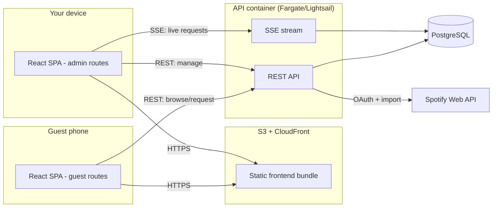

# SetList — Design Document

> Working title. A QR-based live song request service: guests scan a code at your event, browse your curated song catalog, and request tracks. Requests stream in real time to your admin queue so you can see and manage them while you play.

**Author:** Tanner
**Status:** Draft / MVP design
**Scope:** Single host (you), personal use at your own events. No multi-tenancy.

---

## 1. Goals & Non-Goals

### Goals
- Guests scan a QR code and land on a mobile-first request page with **no login required**.
- Page loads your curated song catalog (searchable, browsable).
- Guest taps a song to request it; a duplicate request becomes an **upvote** so popular songs surface.
- New requests **push in real time** to your authenticated admin queue.
- You (admin) manage the queue: mark a song *Now Playing*, **mark it finished (Played)** to clear it from your active queue, or *Dismiss* it.
- Once you mark a song **Played**, guests see an **"Already played"** note on that song so they don't re-request it.
- Catalog is curated by you but **importable from Spotify** (connect once, import playlists/tracks).
- Each event has its own QR code / session so requests are scoped to the current gig.
- You can **pause and resume requests** at any time (dinner, set changes, or when the queue is backed up).
- New requests trigger an **audible + visual alert** on your admin view so you don't have to babysit the screen.
- Guests can optionally add their **first name and a short dedication** to a request (moderated; see §11).
- You can **block a disruptive guest** for the event with one tap.

### Non-Goals (MVP)
- Multi-user / multi-host SaaS (single admin only).
- Playback control or streaming audio (you play music yourself; this only manages *requests*).
- Guest accounts, social features, or payments.
- Native mobile apps (responsive web only).

---

## 2. Personas & Core Flows

**Guest** (anonymous, on their phone):
1. Scans QR → opens `https://app.example.com/e/{eventToken}`.
2. Sees event name + song list; searches or scrolls.
3. Taps *Request* on a song → confirmation; if already requested, their tap counts as an upvote.
4. (Optional) Sees *Now Playing* and their own pending requests.

**Admin** (you, logged in):
1. Log in → dashboard.
2. Create/start an **event** → get a shareable link + QR code (full-screen display mode, or print a table card).
3. Watch the **live queue** update as requests arrive — a soft chime + badge announces each new one; sorted by votes or recency (toggle).
4. Act on requests: *Now Playing* → *Played*, or *Dismiss*. **Block** a guest if they're spamming.
5. **Pause requests** when you need a break; **resume** when ready.
6. Manage catalog: connect Spotify, import tracks, add/hide songs.
7. End event when done.

---

## 3. System Architecture



**Shape of it:** one React SPA served statically from S3/CloudFront, with public guest routes (`/e/:token`) and password-protected admin routes (`/admin`). A single containerized backend serves the REST API plus a Server-Sent Events (SSE) stream for the admin queue. PostgreSQL for storage. Spotify Web API for catalog import.

---

## 4. Tech Stack

| Layer | Choice | Rationale / alternatives |
|---|---|---|
| Frontend | **React + Vite + TypeScript**, Tailwind, TanStack Query | Fast build, mobile-first, matches your stack. |
| QR rendering | `qrcode.react` | Rendered client-side in admin from the event URL. |
| Backend | **Node + TypeScript (Fastify)** | Shared TS types with frontend, mature Spotify OAuth + SSE support. *Alt: Go (Fiber/chi)* — you've shipped Go (`whoop-hr`); viable and lower-footprint, but you'd hand-roll more OAuth/SSE plumbing. |
| Real-time | **Server-Sent Events (SSE)** | Admin only needs to *receive* pushes — SSE is one-directional, auto-reconnects, passes through proxies/CloudFront cleanly, and needs no extra infra. *Alt: WebSocket/Socket.IO* if you later want bidirectional. Admin *actions* just go over normal REST. |
| Database | **PostgreSQL** (RDS or Lightsail managed) | Relational fit for songs/requests/votes. *Alt: SQLite in a volume* for the leanest single-host deploy. |
| Auth | Email + password → **JWT in httpOnly cookie** | Single admin; simple and secure. |
| Infra | AWS: S3+CloudFront (frontend), Fargate **or** Lightsail Containers (API), RDS Postgres | Matches your AWS/Docker/GH Actions experience. Lean option in §12. |
| CI/CD | **GitHub Actions** → ECR → Fargate; S3 sync + CloudFront invalidation | Your existing workflow. |

---

## 5. Data Model

```
admin
  id              uuid pk
  email           text unique
  password_hash   text
  spotify_refresh_token_enc  text null   -- encrypted at rest
  created_at      timestamptz

song            -- your curated catalog
  id              uuid pk
  title           text
  artist          text
  album           text null
  album_art_url   text null
  duration_ms     int null
  spotify_uri     text null unique       -- set if imported
  is_active       bool default true      -- hide without deleting
  created_at      timestamptz

event           -- one per gig
  id              uuid pk
  name            text
  public_token    text unique            -- random, unguessable; goes in the QR URL
  status          text                   -- 'active' | 'ended'
  requests_paused bool default false     -- toggled by admin to pause/resume incoming requests
  created_at      timestamptz
  ended_at        timestamptz null

request
  id              uuid pk
  event_id        uuid fk -> event
  song_id         uuid fk -> song
  status          text                   -- 'pending' | 'playing' | 'played' | 'dismissed'
  vote_count      int default 1
  created_at      timestamptz
  updated_at      timestamptz
  played_at       timestamptz null       -- set when you mark it finished; drives the guest "Already played" note
  queue_position  int null               -- manual order set by admin drag/bump; NULL falls back to vote/recency sort
  unique (event_id, song_id)             -- one row per song per event; dupes upvote

request_vote     -- dedupe upvotes per anonymous guest; also carries the optional name/dedication
  id              uuid pk
  request_id      uuid fk -> request
  requester_token text                   -- anon token from guest localStorage
  requester_name  text null              -- optional first name (moderated, length-capped)
  note            text null              -- optional short dedication (moderated, length-capped)
  created_at      timestamptz
  unique (request_id, requester_token)

blocked_guest    -- guests you've muted for an event
  id              uuid pk
  event_id        uuid fk -> event
  requester_token text
  created_at      timestamptz
  unique (event_id, requester_token)
```

**Dedup logic:** a guest gets a random `requester_token` stored in their browser. Requesting a song either creates a `request` row (vote_count = 1) or, if that song already has a pending request for the event, inserts a `request_vote` and increments `vote_count` — unless that token already voted, in which case it's a no-op (idempotent).

---

## 6. API Design

### Public (no auth, scoped by `public_token`)
| Method | Path | Purpose |
|---|---|---|
| GET | `/api/e/:token` | Event info + catalog metadata, including a `requestsPaused` flag; 404/410 if not active. |
| GET | `/api/e/:token/songs?search=&cursor=` | Paginated / searchable catalog. Each song carries its status for this event (`none` / `pending` / `playing` / `played`) + vote count, so the guest UI can badge **already-played** songs. |
| POST | `/api/e/:token/requests` | Body `{ songId, requesterToken, name?, note? }` → create or upvote. `name`/`note` optional, length-capped + filtered. Rate-limited. Returns `409` if already `played`, `423` if requests are paused, `403` if the guest is blocked. |
| GET | `/api/e/:token/now-playing` | Current *Now Playing* (optional guest display). |

### Admin (JWT cookie)
| Method | Path | Purpose |
|---|---|---|
| POST | `/api/auth/login` / `/api/auth/logout` | Session. |
| GET | `/api/me` | Current admin + Spotify connection status. |
| GET | `/api/spotify/connect` → `/api/spotify/callback` | OAuth Authorization Code flow. |
| GET | `/api/spotify/playlists` | List your playlists. |
| POST | `/api/spotify/import` | Body `{ playlistId }` or `{ trackIds[] }` → upsert into `song`. |
| GET/POST/PATCH/DELETE | `/api/songs` | Catalog CRUD (soft-delete via `is_active`). |
| POST | `/api/events` | Create + start; returns `public_token` + guest URL. |
| PATCH | `/api/events/:id` | End event, or toggle `requestsPaused` to pause/resume incoming requests. |
| GET | `/api/events/:id/requests` | Current queue (sortable), with attached names/dedications. |
| PATCH | `/api/requests/:id` | Body `{ status }` → `playing` / `played` / `dismissed`. Setting `played` stamps `played_at`, removes it from the active queue, and pushes an update so guests immediately see **"Already played."** |
| POST | `/api/events/:id/block` | Body `{ requesterToken }` → mute a disruptive guest for this event; their future requests get `403`. |
| POST | `/api/events/:id/reorder` | Body `{ order: [requestId, ...] }` → sets `queue_position` for a manual queue order (drag or "bump to next"). Pushes a `queue.reordered` update. |
| GET | `/api/events/:id/stream` | **SSE** live request + vote updates. |

---

## 7. Real-Time Notifications (the "notify my login" part)

The admin dashboard opens an authenticated **SSE** connection to `/api/events/:id/stream`. The backend emits events on that channel whenever a request is created, upvoted, or its status changes:

```
event: request.created   data: { requestId, song, voteCount }
event: request.updated   data: { requestId, voteCount, status }
```

The admin React app subscribes with the browser `EventSource` API (auto-reconnecting) and merges updates into the live queue with TanStack Query cache updates. On reconnect it refetches the queue once to catch anything missed. Because a single event rarely has more than one admin viewer (you), a simple in-process pub/sub (an `EventEmitter` per active event) is enough — no Redis needed at this scale. Add Redis pub/sub only if you ever run multiple API replicas.

**New-request alert:** on each `request.created`, the admin UI plays a short chime (Web Audio, so it works without a file) and flashes a badge/count on the queue, with a toggle to mute the sound. Optionally, if you grant permission, it fires a browser `Notification` so you're alerted even when the tab is backgrounded — handy when you're not looking at the screen.

**Guest side reflecting "Played":** when you mark a song finished, the guest catalog needs to show it. Two options — pick per MVP appetite:
- **Simplest (MVP):** the guest song list already returns per-song status, so guests see the **"Already played"** badge on their next list refresh, and any late request attempt is rejected server-side (`409`) with the note shown inline. No extra infra.
- **Live (nice-to-have):** add a lightweight public SSE channel `GET /api/e/:token/stream` that emits only `song.played { songId }` (no queue internals), so open guest pages flip the badge instantly. Keep the payload minimal — guests never see the full admin queue.

---

## 8. Spotify Integration

1. You connect once: `GET /api/spotify/connect` → Spotify Authorization Code flow with `playlist-read-private`, `user-library-read` scopes.
2. Store the **refresh token encrypted** (AES-GCM with a key from AWS Secrets Manager / SSM). Access tokens are short-lived and fetched on demand.
3. `GET /api/spotify/playlists` lists your playlists; `POST /api/spotify/import` pulls tracks and upserts into `song` keyed on `spotify_uri` (idempotent re-imports). Store `album_art_url`, `duration_ms`, artist, title.
4. The catalog stays **yours** — imported songs are just seeded rows you can hide/edit. Nothing plays through Spotify; it's metadata only, which keeps you within API terms.

---

## 9. QR Code & Event Session Flow

- Creating an event mints a random, unguessable `public_token`. The guest URL is `https://app.example.com/e/{public_token}`.
- The admin renders the QR **client-side** (`qrcode.react`) — no image storage needed — with a full-screen "display mode" for showing on a screen.
- **Printable table card / poster:** a print-friendly layout (QR + event name + a one-line "Scan to request a song") you can print as table tents or a poster. Generated client-side via the browser print dialog / a PDF export — physical placement is how guests actually find it.
- Requests are only accepted while `event.status = 'active'`. Ending the event returns `410 Gone` to late scans, so an old QR can't be abused after the gig.
- Optional: rotate to a fresh token per event so last week's card stops working.

---

## 10. Frontend Design

**Guest (`/e/:token`)** — mobile-first, single column:
- Header: event name + optional *Now Playing* banner.
- Sticky search box; virtualized song list (album art thumb, title, artist, request button + live vote count).
- Tap request → optimistic UI + toast; button flips to "Requested ✓ (n)". An optional inline field lets them add a **first name + short dedication** ("for the birthday girl") before confirming.
- When **requests are paused**, a banner reads "Requests are paused — check back soon" and request buttons are disabled.
- **Played songs** show a muted **"Already played ✓"** badge with the request button disabled, so guests know it's already been played and don't re-request it.
- Offline/ended states handled gracefully.

**Admin (`/admin`)** — works on phone or laptop:
- Login screen.
- Event bar: current event, Start/End, **Pause/Resume requests** toggle, **Show QR** (full-screen), **Print card**, and a **mute chime** toggle.
- Live queue: cards sorted by *Votes* or *Recent* (toggle), each with vote count, timestamp, any **guest names/dedications**, and actions (*Now Playing* / *Played* / *Dismiss* / *Block guest*). *Now Playing* is pinned at top. Tapping **Played** (a one-tap "Done") clears the song from the active queue and drops it into a collapsible **Played** section — undoable in case of a mis-tap.
- **Manual reordering:** drag cards (or use ↑/↓ and "Bump to next") to override the sort. Effective order is: *Now Playing* pinned first, then your manual `queue_position`, then the vote/recency sort for anything you haven't touched.
- Catalog tab: search, add/edit/hide songs, **Connect Spotify** + **Import** picker.

Single React app, route-guarded: guest routes public, `/admin/*` requires a valid session.

---

## 11. Auth & Security

- Single admin: email/password (Argon2/bcrypt hash), JWT in an httpOnly, Secure, SameSite cookie. CSRF token on state-changing admin requests (cookie-based auth).
- Public request endpoint: **rate-limited** per IP + per `requesterToken` (e.g. token-bucket, ~1 request / few seconds; N pending requests max per guest).
- `public_token`: 128-bit random, only valid while event active.
- Server-side validation: `songId` must exist in catalog and be active; reject requests to ended events.
- Spotify refresh token encrypted at rest; secrets in SSM/Secrets Manager, never in the repo.
- Abuse surface stays small: guests pick songs from *your* list. The only free text is the optional **name/dedication**, which is length-capped (e.g. name ≤ 24 chars, note ≤ 80), profanity-filtered, and strippable of HTML — and you can hide names entirely or *Block* a guest whose token misbehaves. Because names are optional and unauthenticated, treat them as decorative, not identity.

---

## 12. Deployment & Infra (AWS)

**Recommended:**
- Frontend → **S3 + CloudFront** (ACM TLS, Route 53).
- Backend container → **ECS Fargate** (1 small task), behind an ALB (ALB handles SSE fine; disable response buffering).
- **RDS Postgres** (db.t4g.micro) or Aurora Serverless v2 min-capacity.
- Secrets in **SSM Parameter Store**; images in **ECR**.

**Lean / cost-conscious option** (good for "just me"):
- **Lightsail Containers** (or one small EC2) running the API in Docker; Postgres as a Lightsail managed DB *or* a container with an attached volume; frontend still on S3/CloudFront (or served by the same host).
- Cheapest of all: a single small instance running `docker-compose` (API + Postgres) + Caddy for TLS, frontend on CloudFront.

**CI/CD (GitHub Actions):**
- On push: lint → test → build API image → push to ECR → deploy Fargate service (or SSH/pull on Lightsail).
- Frontend: `vite build` → `aws s3 sync` → CloudFront invalidation.
- Manage two GitHub remotes if you keep this under a separate account, per your existing SSH setup.

---

## 13. Edge Cases & Abuse Prevention

- **Spam taps:** rate limit + one-vote-per-token dedup.
- **Same song requested twice:** collapses into one queue row with incremented votes (unique constraint on `event_id, song_id`).
- **Requesting an already-played song:** blocked server-side (`409`); guest sees the **"Already played"** note. You can still manually re-queue it from the admin Played section if you want an encore.
- **Requests paused:** new requests return `423`; the guest banner explains it. Existing queue is untouched.
- **Blocked guest:** their `requesterToken` gets `403` on future requests; existing requests/votes from them stay unless you dismiss them.
- **Stale QR after event ends:** `410 Gone`; optional token rotation.
- **Guest loses connection mid-request:** requests are idempotent on `(event_id, song_id, requesterToken)`.
- **Admin reconnect:** SSE auto-reconnects; refetch queue once on open.
- **Big catalog:** paginate + server-side search; virtualize the guest list.
- **Empty/duplicate Spotify imports:** upsert on `spotify_uri`.

---

## 14. MVP Scope vs. Later

**MVP:**
- Admin login, one active event at a time, QR display + printable card.
- Curated catalog CRUD + Spotify import.
- Guest browse/search/request with upvote dedup + optional name/dedication.
- Live admin queue over SSE + status actions, with new-request chime/alert.
- Pause/resume requests, block-guest, and manual queue reordering.

**Later / nice-to-have:**
- Guest-facing *Now Playing* + "up next" board.
- Per-event request caps / cooldown settings UI.
- Basic post-event stats (most requested, played vs. dismissed).
- WebSocket upgrade if you want bidirectional features.
- Multiple simultaneous events (already supported by the `event` model; just needs admin UI).

---

## 15. Open Questions / Decisions to Confirm

1. **Backend language:** Node/TS (recommended for shared types + OAuth/SSE ergonomics) vs. Go (your `whoop-hr` experience, smaller footprint)?
2. **DB:** RDS Postgres vs. SQLite-on-a-volume for the leanest single-host deploy?
3. **Deploy target:** Fargate (cleaner scaling) vs. Lightsail/EC2 (lower cost) — for personal event use, Lightsail is likely plenty.
4. Do guests get a *Now Playing* / queue view in MVP, or is that phase 2?
5. One active event at a time, or allow overlapping events from the start?

---

## 16. Local POC (run on your laptop)

A minimal two-container version to prove the flow end-to-end before touching AWS. Ships in `setlist-poc/`:

- **`db`** — `postgres:16`, schema + seed loaded on first boot (`db/init.sql`). Seeds a catalog and a demo event with `public_token = demo`.
- **`api`** — Node + Fastify container that serves the REST API, the SSE stream, and two self-contained vanilla-JS pages (no build step) so it's instantly demoable.

```bash
cd setlist-poc
cp .env.example .env        # set ADMIN_PASSWORD
docker compose up --build
```

Then open:
- **Guest:** `http://localhost:3000/e/demo` — browse, request, upvote, add an optional name/dedication.
- **Admin:** `http://localhost:3000/admin` — log in, watch requests arrive live (with a chime), mark *Now Playing/Played*, pause/resume, block a guest, and reorder the queue.

This POC intentionally trims the production design to move fast: vanilla JS instead of React, an env-var admin password instead of full JWT/CSRF, and no TLS. The data model, endpoints, SSE events, and queue-ordering logic all mirror the sections above, so the path to production is: swap in the React frontend, put Caddy in front for TLS, and lift the two containers onto a $5 Lightsail box (§12).
